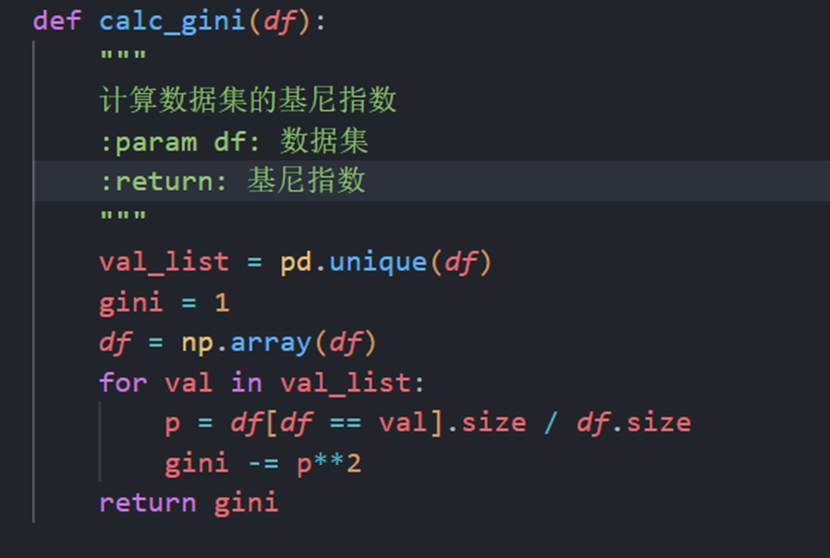
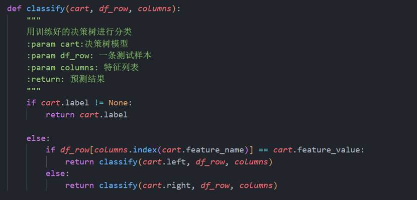

# HITSZ 2023秋季学期大数据实验二

# 手搓CART决策树

# 

# 1. 项目文件结构

210110820_余圣源_大数据实验二.docx      本次实验报告

Test_adult.csv                           测试集

Train_adult.csv                          训练集

Cart.npy                                 	 保存的决策树模型

Test_pred.csv                            保存的测试集预测结果

Lab2.ipynb                                实验代码

# 2. 数据处理

首先去除测试集和训练集中的空行：

​​

异常值处理，删除有异常值的行：

​​

​​

观察数据，准备对数据进行分类：

​​

​​

​​

​​

观察数据后将其分为离散型和连续性数据两类，并选择其中若干列作为特征，然后对部分连续型变量分组：

​​

分组后设置独热编码：

​​

​​

离散型变量：

​​

对离散型变量中的“国籍”分为发达国家和发展中国家，同时对“受教育程度”也分类，分类完成之后对所有选取的离散型变量独热编码：

​​

最后将income分为0,1并采用独热编码，并大致确认最后得到的train_set和test_set：

​​

大致得到的结果如下，有59个特征列：

​​

# 3. 构造决策树

定义树节点：

​​

求取基尼指数：

​​

按照选出的特征feature和特征值将数据集分为两个，由于我们的数据集全部转换为了独热编码，只有0和1两种取值，因此此处分为“等于”和“不等于”两类即可；注意在划分完某个features之后，后续的划分不会再用到它，因此手动删去：

​​

构造决策树，先设定三种递归终止情况，再递归地构造决策树：

​​

训练并保存决策树：

​​

# 4. 验证准确率

通过递归的方法沿着决策树找到某一条数据的预测值：

​​

预测整个测试集：

​​

按照预测计算准确率：

​​

预测并计算准确率和保存预测值，可以看到，本决策树模型在测试集上的准确率达到了0.755 )：

​

‍

~~总体来说，这数据清洗挺烂的，大家伙看看就好，可别直接抄了~~

:)
